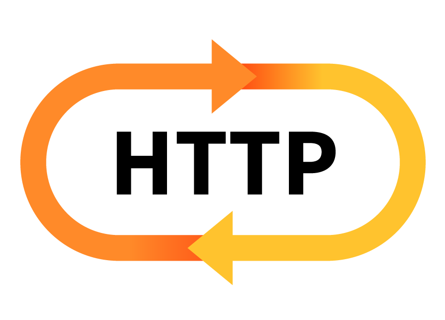

<!-- PROJECT LOGO -->
 

  

  <h3 align="center">HTTP/1.1 Server</h3>
    

    Implemented HTTP/1.1 an application-level protocol based on RFC 2616.    

  

<!-- TABLE OF CONTENTS -->

  
<h2 style="display: inline-block">Table of Contents</h2>

  <ol>
    <li>
      <a href="#about-the-project">About The Project</a>
    </li>
    <li>
      <a href="#getting-started">Getting Started</a>
    </li>
    <li><a href="#usage">Usage</a></li>
    <li><a href="#contributing">Contributing</a></li>
    <li><a href="#author">Author</a></li>
    <li><a href="#acknowledgements">Acknowledgements</a></li>
  </ol>

<!-- ABOUT THE PROJECT -->
## About The Project

**HTTP/1.1 protocol** implementation. HTTP has messages which consist of requests from client to server and responses from server to client. Query consist different methods, status codes, headers, MIME-types etc.

* **Methods Handled**
    * GET
    * POST
    * HEAD
    * PUT
    * DELETE

* **Status Codes Handled**
    * 200 : OK
    * 201 : Created
    * 202 : Accepted
    * 400 : Bad Request
    * 401 : Unauthorized
    * 403 : Forbidden
    * 404 : Not Found
    * 415 : Unsupported Media Type
    * 505 : HTTP Version Not Supported
  
 *Multithreading* in server is implemented to run multiple requests simultaneously. Config file is maintained where important details like authorization, size, resources, logs, root directory etc are mentioned. Other features includes logging, cookies. Screenshots are also added in the project directory.
 
 **Note**: To check for the history of requests made to server, refer data.log in htdocs folder. 

<!-- GETTING STARTED -->
## Getting Started
1. Clone the repo.
2. Navigate to the project directory.

**Note**: Make sure python3 is supported.

<!-- USAGE EXAMPLES -->
## Usage

1. Run server by:
    
    **Usage:** python3 ./server <port_no>[OPTIONAL]  
    
    **Note:** By default the port number is 9000
    
2. To run the Test Suite:  

    * **Usage:** python3 test.py <port_no>
    * **Usage:** python3 test_browser.py <port_no>

**Note**:  Make sure that the port number is same i.e where the server is running. Also before running this file, make sure server is started.

<!-- CONTRIBUTING -->
## Contributing

Contributions make the open source community an amazing place to be learn, inspire, and create. Any contribution made is **greatly appreciated**.

1. Fork the Project
2. Create your Feature Branch (`git checkout -b feature/AmazingFeature`)
3. Commit your Changes (`git commit -m 'Add some AmazingFeature'`)
4. Push to the Branch (`git push origin feature/AmazingFeature`)
5. Open a Pull Request

<!-- CONTACT -->
## Author

[Deepika Goyal](https://github.com/deepika9294)

<!-- ACKNOWLEDGEMENTS -->
## Acknowledgements

* [RFC 2616](https://datatracker.ietf.org/doc/html/rfc2616)

